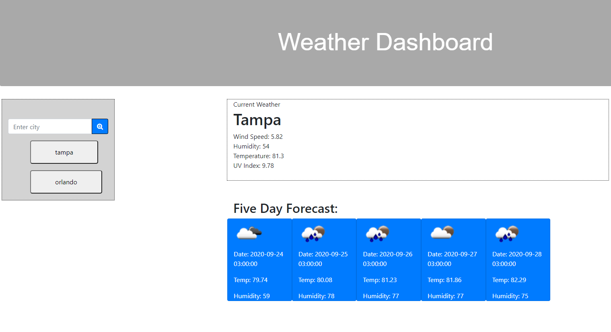

# WeatherDashboard
Server side APIs

This is a page utilizing a weather api for current weather, five day forecast, and uv index.
With these implemented you can search for a city and get the current temp, wind speed, humidity, and uv index.
On the left you have a search bar as well as recent search history.
The current and 5 day will continue to display the last viewed city weather. 
With more time I could have gotten the uv index to change colors, and a few other edits.

Erika Zibelnik
